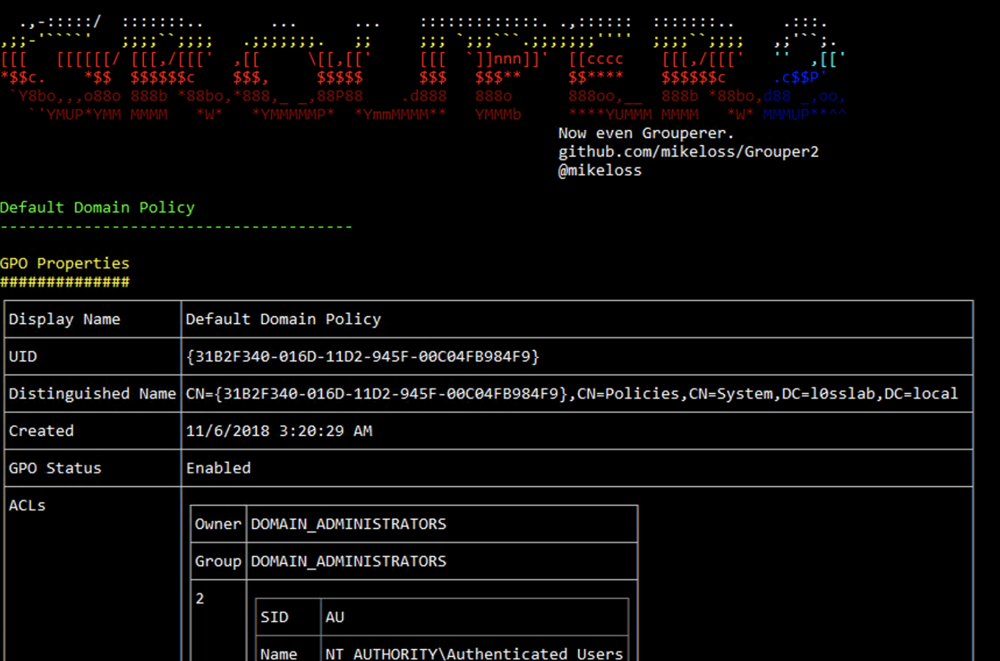
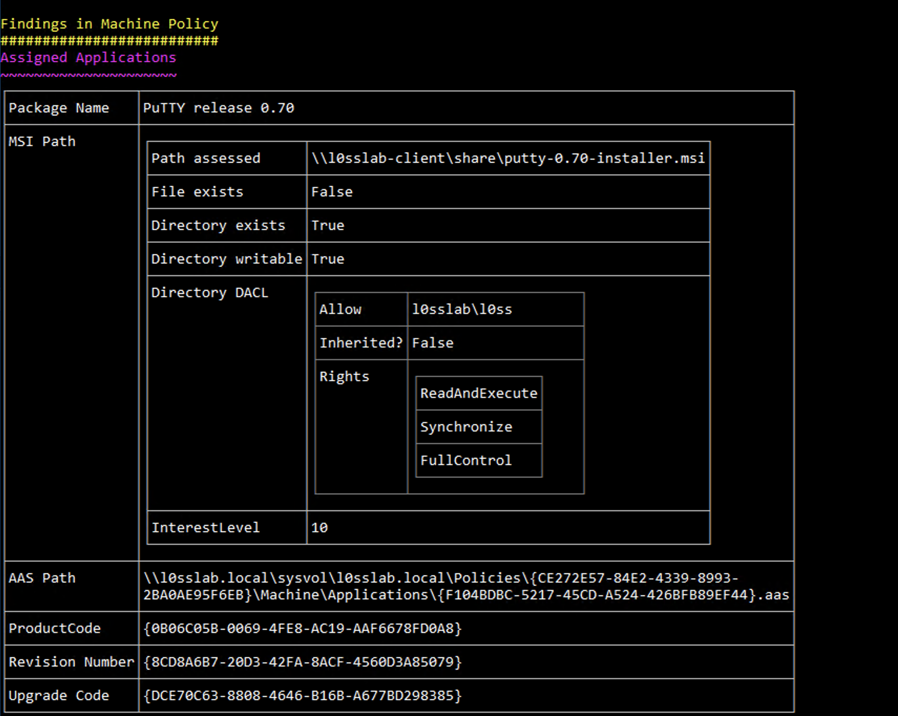
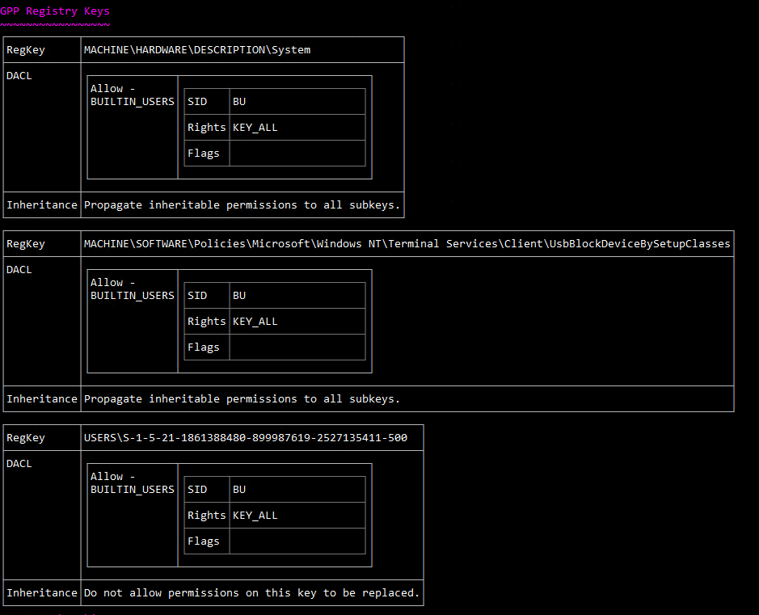

# GROUPER2 IS DEPRECATED, GOTO https://github.com/Group3r/Group3r INSTEAD



C# rewrite of Grouper - *WAY* better than the original.

[](https://ko-fi.com/T6T31VEVJ)

[](https://ci.appveyor.com/project/l0ss/grouper2/branch/master)

## What is it for? 

Grouper2 is a tool for *pentesters* to help find security-related misconfigurations in Active Directory Group Policy.

It might also be useful for other people doing other stuff, but it is explicitly NOT meant to be an audit tool. If you want to check your policy configs against some particular standard, you probably want Microsoft's Security and Compliance Toolkit, not Grouper or Grouper2.

## What does it do?

It dumps all the most interesting parts of group policy and then roots around in them for exploitable stuff.

## How is it different from Grouper?

Where Grouper required you to:

 - have GPMC/RSAT/whatever installed on a domain-joined computer

-  generate an xml report with the Get-GPOReport PowerShell cmdlet

 - feed the report to Grouper

 - a bunch of gibberish falls out and hopefully there's some good stuff in there.

Grouper2 does like Mr Ed suggests and goes straight to the source, i.e. SYSVOL.

This means you don't have the horrible dependency on Get-GPOReport (hooray!) but it also means that it has to do a bunch of parsing of different file formats and so on (booo!).

Other cool new features:

 - better file permission checks that don't involve writing to disk.
 - doesn't miss those GPP passwords that Grouper 1 did.
 - HTML output option so you can preserve those sexy console colours and take them with you.
 - aim Grouper2 at an offline copy of SYSVOL if you want.
 - it's multithreaded!
 - a bunch of other great stuff but it's late and I'm tired.

Also, it's written in C# instead of PowerShell.

## How do I use it?

Literally just run the EXE on a domain joined machine in the context of a domain user, and magic JSON candy will fall out.

If the JSON burns your eyes, add ```-g``` to make it real pretty.

If you love the prettiness so much you wanna take it with you, do ```-f "$FILEPATH.html"``` to puke the candy into an HTML file.

If there's too much candy and you want to limit output to only the tastiest morsels, set the 'interest level' with ```-i $INT```, the bigger the number the tastier the candy, e.g. ```-i 10``` will only give you stuff that will probably result in creds or shells.

If you don't want to dig around in old policy and want to limit yourself to only current stuff, do ```-c```.

If you want the candy to fall out faster, you can set the number of threads with ```-t $INT``` - the default is 10.

If you want to see the other options, do ```-h```.


## I don't get it.

OK have a look at this:



In the screenshot above we can see an "Assigned Application" policy that is still being pushed to computers, but the MSI file to install is missing, and the directory it's being installed from is writable by the current user. 

If you created a hacked up MSI (e.g. with msfvenom) and then modified it to match the UIDs at the bottom of the picture, it would get executed on machines targeted by the GPO. Sweet!



In this one you can see that someone's done something absolutely insane to the ACLS on the registry.

You get the picture.

## How can I help?

Look at the dev branch, Sh3r4 has been working on a big refactor to make it easier to maintain and more efficient going forward.

A rough roadmap ATM is:

 - Get dev branch functioning at least as well as master does.
   - If you want to help with this, look at issues tagged 'dev'.
 - Finish basic unit tests of assessment and interest-level code blocks.
 - Bring the big refactor over to master.
 - Start actually working on the other issues and features and whatnot.

If you want to discuss via Slack you can ping me (@l0ss) on the BloodHound Slack, joinable at https://bloodhoundgang.herokuapp.com/, or chat with a group of contributors in the #Grouper channel.

## Credits and Thanks
 - Huge thanks to Sh3r4 for all her help, I have no idea how to write code and it would show way worse without her.
 - Much assistance and code cleanup from @liamosaur
 - SDDL parsing from https://github.com/zacateras/
 - Thanks to @skorov8 for providing some useful registry key data.
